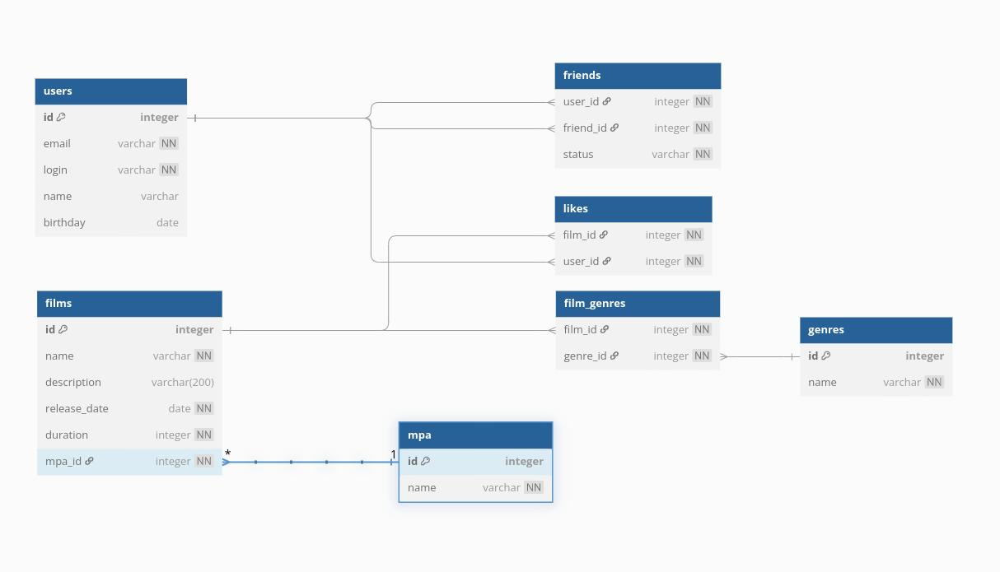

# Мой проект

Вот скриншот интерфейса:




# Примеры SQL-запросов для приложения Filmorate

## 📌 Тестовые данные:

### Пользователи:
| ID | Email            | Логин | Имя            | День рождения |
|----|------------------|-------|----------------|---------------|
| 1  | ivan@mail.ru     | ivan  | Иван Петров    | 1990-05-15    |
| 2  | maria@yandex.ru  | maria | Мария Сидорова | 1985-08-22    |
| 3  | alex@google.com  | alex  | Алексей Иванов | 1995-11-30    |

### Фильмы:
| ID | Название         | Дата выхода | Длительность | MPA | Жанры               |
|----|------------------|-------------|--------------|-----|---------------------|
| 1  | Брат            | 1997-12-12  | 100 мин.     | R   | драма               |
| 2  | Ирония судьбы   | 1975-12-31  | 184 мин.     | PG  | комедия, мелодрама  |
| 3  | Легенда №17     | 2013-04-18  | 134 мин.     | PG-13| спорт, драма        |

## 🔍 Примеры запросов

### 1. Получение всех пользователей
```sql
SELECT id, email, login, name, birthday 
FROM users;

| id | email            | login | name          | birthday   |
|----|------------------|-------|---------------|------------|
| 1  | ivan@mail.ru     | ivan  | Иван Петров   | 1990-05-15 |
| 2  | maria@yandex.ru  | maria | Мария Сидорова| 1985-08-22 |
| 3  | alex@google.com  | alex  | Алексей Иванов| 1995-11-30 |
```
### 2. ТОП-3 популярных фильмов
```sql
SELECT f.id, f.name, COUNT(l.user_id) AS likes
FROM films f
         LEFT JOIN likes l ON f.id = l.film_id
GROUP BY f.id
ORDER BY likes DESC
    LIMIT 3;

| id | name          | likes |
|----|---------------|-------|
| 3  | Легенда №17   | 5     |
| 1  | Брат          | 3     |
| 2  | Ирония судьбы | 1     |
```
### 3. Друзья пользователя (с статусом)
```sql
SELECT u.name, f.status 
FROM friends f
JOIN users u ON f.friend_id = u.id
WHERE f.user_id = 1;

| name          | status        |
|---------------|---------------|
| Мария Сидорова | подтверждённая |
| Алексей Иванов | подтверждённая |
```
### 4. Общие друзья двух пользователей
```sql
SELECT u.name
FROM friends f1
JOIN friends f2 ON f1.friend_id = f2.friend_id
JOIN users u ON f1.friend_id = u.id
WHERE f1.user_id = 1 AND f2.user_id = 2;

| name          |
|---------------|
| Алексей Иванов |
```
### 5. Фильмы с указанным жанром
```sql
SELECT f.name, f.release_date
FROM films f
         JOIN film_genres fg ON f.id = fg.film_id
         JOIN genres g ON fg.genre_id = g.id
WHERE g.name = 'драма';

| name        | release_date |
|-------------|--------------|
| Брат        | 1997-12-12   |
| Легенда №17 | 2013-04-18   |
```

### 6. Проверка, поставил ли пользователь лайк фильму
```sql
SELECT EXISTS(
    SELECT 1 
    FROM likes 
    WHERE film_id = 3 AND user_id = 1
) AS has_like;

has_like
true
```
### 7. Получение жанров фильма
```sql
SELECT g.id, g.name
FROM film_genres fg
JOIN genres g ON fg.genre_id = g.id
WHERE fg.film_id = 3
ORDER BY g.id;

id	name
2	драма
5	спорт
```
### 8. Получение списка популярных фильмов (по количеству лайков)
```sql
SELECT f.id, f.name, COUNT(l.user_id) AS likes_count
FROM films f
         LEFT JOIN likes l ON f.id = l.film_id
GROUP BY f.id, f.name
ORDER BY likes_count DESC
    LIMIT 10;

id	name	likes_count
3	Легенда №17	5
1	Брат	3
2	Ирония судьбы	1
```
### 9. Получение всех фильмов с их MPA рейтингом
```sql
SELECT f.id, f.name, f.release_date, f.duration, m.name AS mpa_rating
FROM films f
JOIN mpa m ON f.mpa_id = m.id;

id	name	release_date	duration	mpa_rating
1	Брат	1997-12-12	100	R
2	Ирония судьбы	1975-12-31	184	PG
3	Легенда №17	2013-04-18	134	PG-13
```


```sql
Table mpa {
id integer [primary key, increment]
name varchar(50) [not null, unique]
}

Table genres {
id integer [primary key, increment]
name varchar(50) [not null, unique]
}

Table users {
id integer [primary key, increment]
email varchar(100) [not null, unique]
login varchar(50) [not null]
name varchar(100) [not null]
birthday date
}

Table films {
id integer [primary key, increment]
name varchar(100) [not null]
description varchar(200)
release_date date
duration integer
mpa_id integer [not null]
}

Table film_genres {
film_id integer [not null]
genre_id integer [not null]
}

Table friends {
id integer [primary key, increment]
user_id integer [not null]
friend_id integer [not null]
Indexes {
(user_id, friend_id) [unique]
}
}

Table likes {
id integer [primary key, increment]
film_id integer [not null]
user_id integer [not null]
created_date timestamp [not null]
Indexes {
(film_id, user_id) [unique]
film_id
user_id
}
}

// Связи между таблицами
Ref: films.mpa_id > mpa.id

Ref: film_genres.film_id > films.id
Ref: film_genres.genre_id > genres.id

Ref: friends.user_id > users.id
Ref: friends.friend_id > users.id

Ref: likes.film_id > films.id
Ref: likes.user_id > users.id 

```